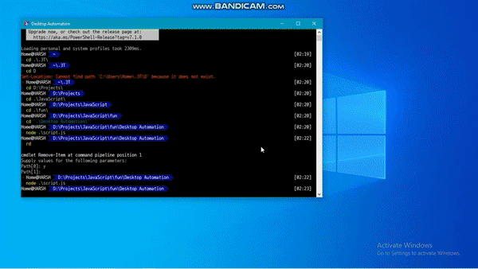

# Desktop-Automation 🖥️
A script used to automate your day to day task

### Idea behind this Project 💡
- Whenever I open my laptop I start some specific 3-4 softwares to work upon.
- I have created a script that'll help me automate this redundant task of opening softwares.
- Currently it will open Openboard, Telegram, Chrome and Vscode because these are the only things I usually open on my system.

### Usage 🚀
```
  npm install
  node script.js
```
### Demo 🔥


Made with ❤️ by <b>HS</b>
<p>MIT License</p>

